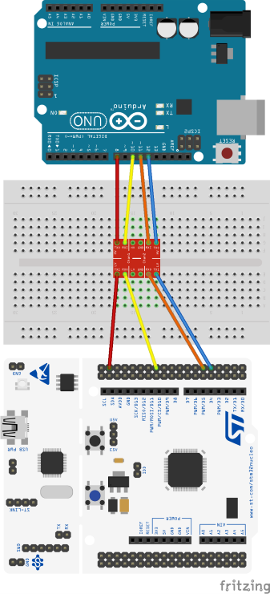
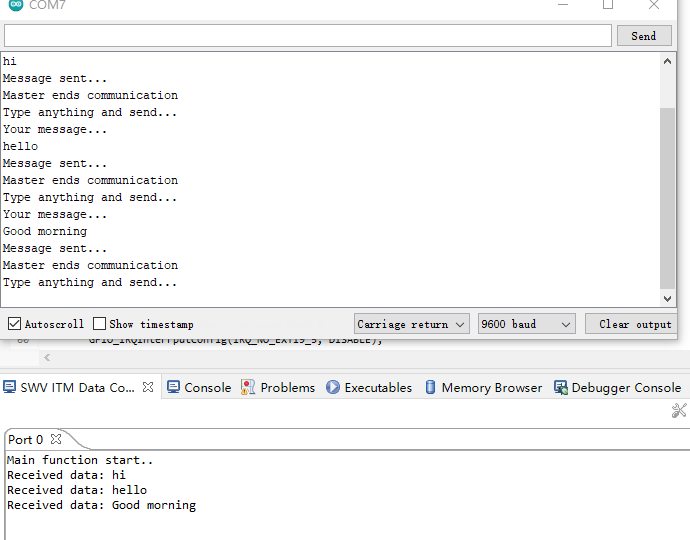

# stm32f446re_spi_driver

Drivers for SPI peripherals of STM32F446RE Microcontroller and some demo.

## Requirements

1.	[STM32 Nucleo-64 development board](https://www.st.com/en/evaluation-tools/nucleo-f446re.html)
2.	[Arduino Uno board](https://store.arduino.cc/arduino-uno-rev3)
4.	[Logic Level Converter](https://www.sparkfun.com/products/12009)
5.	[Logic Analyzer](https://www.amazon.de/gp/product/B01MUFRHQ2/ref=ppx_yo_dt_b_asin_title_o00_s00?ie=UTF8&th=1) (Optional)
6.	Bread board
7.	Jumper wires

# Installation

`git clone https://github.com/xuanjiao/stm32f446re_driver.git`

# Usage

Copy the entire `driver` folder to your project directory. In `driver` folder,

- `stm32f446xx.h` is MCU specific header file which contains microcontroller specific data
-  `stm32f446xx_gpio.h` and `stm32f446xx_spi.h` are driver header files which contains driver specific data 
-  `stm32f446xx_gpio.c` and `stm32f446xx_spi.c` are driver source files

## Run demo
1. Build the circult (Figure 1)
1. Open arduino program in `Arduino` folder and flash it to Arduino Uno board 
2. Open project in IDE (e.g. STM32Cube), build project with `spi_msg_recv_it.c` file
3. Enter IDE debug perspective and start the SWV trace 
4. Open Arduino Serial monitor and type a message
5. The message will be received by the master and shown in SWV ITM Data console (Figure 2)
6. Connect pins to logic analyzer (Figure 3)

Figure 1: Circult design

Figure 2: Message transmission over SPI

Figure 3: Logic analyser view

